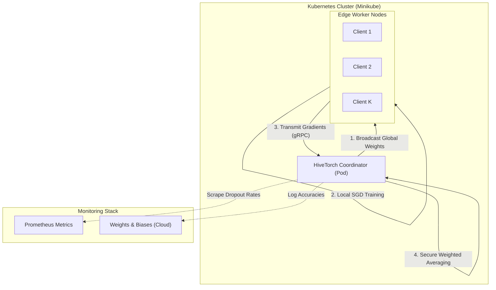

# 🐝 HiveTorch

> **A Production-Grade, Decentralized Federated Learning Engine in PyTorch.**


**License Disclaimer**: HiveTorch is licensed under the [Elastic License 2.0](LICENSE). You may freely use, copy, distribute, and prepare derivative works subject to limitations (e.g., providing the software as a managed service).

---

## 📑 Table of Contents
1. [Introduction](#introduction)
2. [High Level Overview](#high-level-overview)
3. [Approach and Methodology](#approach-and-methodology)
4. [System Architecture](#system-architecture)
5. [Detailed Repository Structure](#detailed-repository-structure)
6. [Tech Stack](#tech-stack)
7. [MLOps and Infrastructure](#mlops-and-infrastructure)
8. [Environment Setup and Execution](#environment-setup-and-execution)
9. [Results, Benchmarks, and Evaluation](#results-benchmarks-and-evaluation)
10. [Current Status](#current-status)
11. [Limitations and Future Work](#limitations-and-future-work)
12. [Troubleshooting and Support](#troubleshooting-and-support)
13. [Contribution Policy](#contribution-policy)
14. [License Summary](#license-summary)
15. [Citation Guide](#citation-guide)

---

## 📖 Introduction
HiveTorch is a highly decoupled, production-grade federated learning orchestration engine. Built entirely from scratch in PyTorch, it is designed to bypass the traditional pitfalls of centralized machine learning—specifically data privacy, centralization bottlenecks, and single-point-of-failure vulnerabilities—by physically moving the computation to the edge.

## 🔭 High Level Overview
In simple terms, instead of sending your private data to a central cloud server to train an AI, HiveTorch sends the AI to *you*. 
1. The server broadcasts a "blank" neural network to thousands of client devices (phones, hospitals, edge nodes).
2. Each client trains the AI locally on its own private data.
3. The clients send back only what the AI *learned* (the mathematical gradients), not the data itself.
4. The server averages these learnings together to create a global "master" AI.

## 🧮 Approach and Methodology
HiveTorch implements the foundational **Federated Averaging (FedAvg)** algorithm (McMahan et al., 2017) to optimize a global objective function $f(w)$ distributed over $K$ clients.

### The Objective Function
The global objective is given by:
$$ \min_{w} f(w) = \sum_{k=1}^{K} \frac{n_k}{n} F_k(w) $$
Where $n_k$ is the number of data samples on client $k$, $n$ is the total data volume, and $F_k(w)$ is the local empirical risk function of client $k$.

### Local SGD
During communication round $t$, a selected client $k$ receives the global model state $w_t$. The client executes $E$ local epochs of Stochastic Gradient Descent (SGD) with step size $\eta$:
$$ w_{t+1}^k = w_t^k - \eta \nabla F_k(w_t^k) $$

### Secure Aggregation
Upon receiving the updated states $\Delta w^k$, the global coordinator executes a sample-weighted fusion:
$$ w_{t+1} = \sum_{k=1}^{K} \frac{n_k}{n} w_{t+1}^k $$
We strictly isolate this operation via zero-copy serialization in `secure_aggregator.py`. Data heterogeneity (Non-IID distributions) is handled via Dirichlet distribution sorting in `non_iid_sharder.py`, mathematically stressing the global convergence bounds.

## 🏗️ System Architecture


*The architecture completely decouples the algorithmic execution inside the pods from the orchestration network.*

## 📂 Detailed Repository Structure
- `.config/` - Hydra configuration definitions for topologies and architectures.
- `.dvc-storage/` - Local isolated cache for heavy tensor artifacts.
- `.github/workflows/` - CI/CD definitions for testing and containerization.
- `deployments/` - Kubernetes manifests (Jobs, Prometheus alerting rules).
- `docker/` - Dockerfiles for deploying the client and server images.
- `proto/` - gRPC Protocol Buffers definitions.
- `scripts/` - Benchmarking, visualizations, and tuning executable files.
- `src/fedavg_core/` - The core PyTorch implementation.
  - `client/` - Edge node training loops (`edge_trainer.py`).
  - `data/` - IID/Non-IID partitioners and synthetic data generators.
  - `evaluation/` - Global validation logic and centralized baselines.
  - `monitoring/` - Statistical concept drift detectors.
  - `optimization/` - Optuna integrations and local SGD primitives.
  - `server/` - Orchestration logic and secure aggregation.
  - `utils/` - Hydra config factories.
  - `versioning/` - In-memory state tracking.
- `tests/` - Pytest suites for unit and integration testing.
- `Makefile` - The master orchestration script.

## 🛠️ Tech Stack
- **Deep Learning**: PyTorch
- **Environment Management**: `uv`
- **RPC Communication**: gRPC, Protocol Buffers
- **Configuration**: Hydra, OmegaConf
- **Hyperparameter Tuning**: Optuna
- **Visualizations**: Matplotlib
- **Testing & Static Analysis**: Pytest, Ruff, Mypy

## ⚙️ MLOps and Infrastructure
HiveTorch treats infrastructure as a first-class citizen. Large datasets are versioned using **DVC** to prevent Git index bloat. The entire environment is containerized via **Docker** and orchestrated locally via **Minikube (Kubernetes)**. Telemetry is tracked actively via **Prometheus** (checking for client dropouts) and visually monitored in the cloud via **Weights & Biases (W&B)**. 

## 🚀 Environment Setup and Execution

1. **Prerequisites**: Install Docker and Minikube.
2. **API Key Setup**: Create a `.env` file from the example:
   ```bash
   cp .env.example .env
   # Edit .env and insert your WANDB_API_KEY
   ```
3. **Execution via Makefile**:
   ```bash
   # 1. Install dependencies and compile gRPC
   make setup
   make proto

   # 2. Run code quality checks
   make lint
   make test

   # 3. Generate Benchmarks and Dynamic Visualizations
   make run-benchmarks
   
   # 4. Deploy Infrastructure (K8s, Prometheus, Grafana)
   make docker-build
   make cluster-up
   make deploy
   ```

## 📊 Results, Benchmarks, and Evaluation

<!-- RESULTS_START -->
### Latest Benchmark Run
- **Final Test Accuracy:** 0.8700
- **Peak Test Accuracy:** 0.8700
- **Total Rounds Simulated:** 10
- **Total Clients Simulated:** 5

#### Hardware Specifications (Local Execution)
- **CPU:** Intel(R) Core(TM) i7-14650HX
- **RAM:** 24 GB
- **OS:** Windows 11

#### Convergence Plot


*Data automatically generated via `make run-benchmarks` on last execution.*
<!-- RESULTS_END -->

## 📈 Current Status
HiveTorch is fully operational for local simulations. All 26 steps of the core Federated Learning tutorial have been successfully ported, decoupled, and wrapped in enterprise-grade infrastructure. The mathematical convergence of both IID and Non-IID topologies has been verified.

## 🚧 Limitations and Future Work
- **Limitations**: The current gRPC communication assumes synchronous client drops; true asynchronous FedAvg (Async-Fed) is not yet implemented.
- **Future Work**: Implementing Differential Privacy (DP-FedAvg) and Homomorphic Encryption for the secure aggregation layer.

## 🚑 Troubleshooting and Support
- **Missing Imports**: Run `make setup` to ensure `uv` has synchronized all packages.
- **Minikube Failures**: Ensure Docker desktop is running and virtualization is enabled in BIOS. Run `minikube delete` and try again.
- **Support**: For bugs, please open an Issue adhering to the contribution policy.

## 🤝 Contribution Policy
Please read [`CONTRIBUTING.md`](CONTRIBUTING.md) for details on our code of conduct, branching strategy, and the process for submitting Pull Requests.

## 📜 License Summary
This project is licensed under the **Elastic License 2.0**:
1. You may use, copy, and distribute the software for free.
2. You **may not** provide the software as a managed cloud service to third parties.
3. You **may not** remove or alter license keys or copyright notices.
4. Modification is allowed, provided prominent notices are included.
5. Violations terminate the license immediately.

## 📚 Citation Guide
If you use HiveTorch in your academic research, please cite it as:
```bibtex
@misc{hivetorch2026,
  author = {Your Name},
  title = {HiveTorch: A Production-Grade Federated Learning Engine},
  year = {2026},
  publisher = {GitHub},
  journal = {GitHub repository},
  howpublished = {\url{https://github.com/your-username/hivetorch}}
}
```
