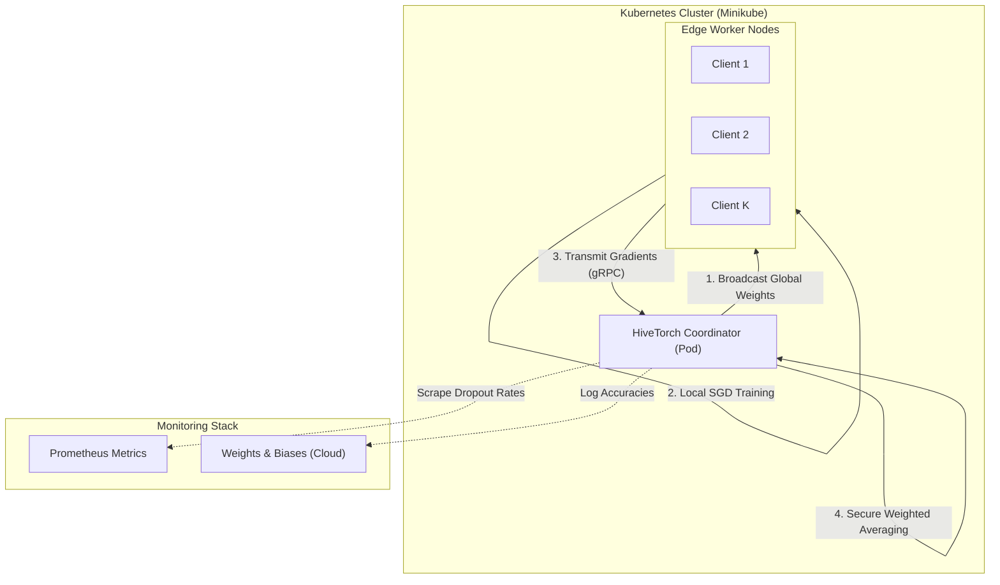
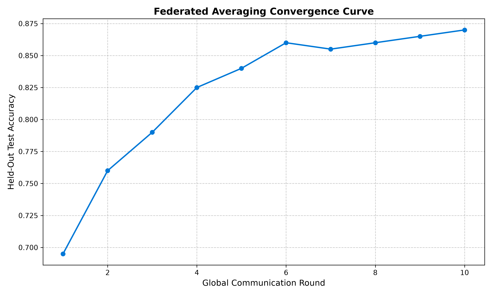

# HiveTorch

> **A Production-Grade From-Scratch Implementation of a Federated Learning Engine in PyTorch.**


**License Disclaimer**: HiveTorch is licensed under the [Elastic License 2.0](LICENSE). You may freely use, copy, distribute, and prepare derivative works subject to limitations (e.g., providing the software as a managed service).

---

## Table of Contents
1. [Introduction](#introduction)
2. [High Level Overview](#high-level-overview)
3. [Approach and Methodology](#approach-and-methodology)
4. [System Architecture](#system-architecture)
5. [Repository Structure](#repository-structure)
6. [Technologies and Tools Used](#technologies-and-tools-used)
7. [MLOps and Infrastructure](#mlops-and-infrastructure)
8. [Environment Setup and Execution](#environment-setup-and-execution)
9. [Results, Benchmarks, and Evaluation](#results-benchmarks-and-evaluation)
10. [Current Status](#current-status)
11. [Limitations and Future Work](#limitations-and-future-work)
12. [Troubleshooting and Support](#troubleshooting-and-support)
13. [Contribution Policy](#contribution-policy)
14. [License Summary](#license-summary)
15. [Citation Guide](#citation-guide)

---

## Introduction
HiveTorch is a highly decoupled, production-grade from-scratch implementation of a federated learning orchestration engine. Built entirely in PyTorch, it is designed to explore and bypass the traditional pitfalls of centralized machine learning—specifically data privacy, centralization bottlenecks, and single-point-of-failure vulnerabilities—by physically moving the computation to the edge.

## High Level Overview
In a standard machine learning paradigm, private data from users is aggregated into a central database to train a model. Federated Learning inverts this dynamic. Instead of bringing the data to the model, HiveTorch brings the model to the data. 

The global coordinator (server) initializes a neural network and broadcasts it to distributed client devices. Each client trains the model locally using its own private data partition. Rather than returning the sensitive data, the clients return only the mathematical weight updates (gradients). The server then securely aggregates these disparate updates to form a single, globally improved model. This cycle repeats, resulting in a robust global model trained collaboratively without ever compromising local data privacy.

## Approach and Methodology
HiveTorch implements the foundational Federated Averaging (FedAvg) algorithm to optimize a global objective function distributed over multiple clients. The architecture strictly isolates local client stochastic gradient descent from the global server aggregation logic.

### The Objective Function
The global objective is defined as minimizing the loss over the entire distributed dataset. We formulate this as:

```math
\min_{w} f(w) = \sum_{k=1}^{K} \frac{n_k}{n} F_k(w)
```

Where:
- `K` is the total number of clients participating in the network.
- `n_k` is the number of local data samples present on client `k`.
- `n` is the total data volume across all clients.
- `F_k(w)` is the local empirical risk function of client `k` evaluated on the model weights `w`.

### Local Optimization (Edge Training)
During a given communication round `t`, a subset of clients receives the current global model state `w_t`. Each client executes `E` local epochs of Stochastic Gradient Descent (SGD) with a learning rate `\eta`. The update rule for a client `k` is:

```math
w_{t+1}^k = w_t^k - \eta \nabla F_k(w_t^k)
```

By completing multiple epochs locally, the communication overhead between the clients and the server is drastically reduced compared to standard distributed SGD.

### Secure Aggregation (Global Fusion)
Upon receiving the updated states from the clients, the global coordinator executes a sample-weighted fusion. This ensures that clients with larger datasets proportionally influence the global model:

```math
w_{t+1} = \sum_{k=1}^{K} \frac{n_k}{n} w_{t+1}^k
```

This operation is securely isolated via zero-copy serialization in `secure_aggregator.py`. To rigorously test the mathematical convergence bounds of this aggregation, HiveTorch includes a `non_iid_sharder.py` which forces data heterogeneity using a Dirichlet distribution, simulating real-world scenarios where different hospitals or phones hold vastly skewed, non-IID data distributions.

## System Architecture



**Architecture Explanation:**
The system is bifurcated into two distinct layers: the Algorithmic Layer and the Orchestration Layer. 
1. **The Server Coordinator** sits in the master node. It holds the global state registry and orchestrates the rounds. It initiates the communication by broadcasting the serialized neural network state to the selected client nodes.
2. **The Client Nodes** represent edge devices. Upon receiving the payload, they deserialize it, load it into a local PyTorch model, and execute standard backpropagation against their local data shard.
3. **The Transport Layer** utilizes gRPC and Protocol Buffers to ensure that the tensor transmission over the network is strictly typed, binary-packed, and memory-efficient.
4. **The Telemetry Stack** is decoupled. The server emits metrics to Weights & Biases for experiment tracking, while Kubernetes exposes a Prometheus endpoint to monitor system health, such as network latency and client dropout rates.

## Repository Structure

```text
HiveTorch/
├── .config/                    # Hydra YAML configurations
│   ├── federation/
│   │   ├── model/              # Neural architecture definitions (e.g., deep_cnn.yaml)
│   │   └── topology/           # IID and Non-IID distribution settings
├── .dvc-storage/               # Local cache for DVC tracked datasets and tensor artifacts
├── .github/workflows/          # CI/CD pipelines (Integration and Containerization)
├── deployments/                # Kubernetes manifests
│   ├── k8s-simulation-job.yaml # StatefulSets and Jobs for Server/Clients
│   └── prometheus-rules.yaml   # AlertManager rules for system health
├── docker/                     # Containerization definitions
│   ├── Dockerfile
│   └── docker-compose.yml
├── proto/                      # gRPC Protocol Buffer definitions
│   └── federated.proto
├── scripts/                    # Execution, benchmarking, and visualization scripts
│   ├── analyze_heterogeneity.py
│   ├── orchestrate_simulation.py
│   ├── run_benchmarks.py
│   └── tune_hyperparameters.py
├── src/fedavg_core/            # Core PyTorch federated implementation
│   ├── client/                 # Edge node training logic
│   ├── data/                   # Data ingestion and Dirichlet partitioners
│   ├── evaluation/             # Global validation and baseline testing
│   ├── models/                 # PyTorch nn.Module architectures
│   ├── monitoring/             # Statistical concept drift detection
│   ├── optimization/           # Local optimizers and weight alignment
│   ├── server/                 # Global orchestration and secure aggregation
│   ├── utils/                  # Configuration factories and tracking
│   └── versioning/             # State registry and memory management
├── tests/                      # Pytest suite
│   ├── integration/            # Multi-node loop testing
│   └── unit/                   # Aggregation and math correctness testing
├── Makefile                    # Centralized orchestration command interface
├── pyproject.toml              # Project metadata and dependencies
└── uv.lock                     # Deterministic dependency lockfile
```

## Technologies and Tools Used
- **Deep Learning Framework**: PyTorch
- **Package Management**: Astral `uv`
- **Configuration Management**: Hydra / OmegaConf
- **Network Protocol**: gRPC with Protocol Buffers
- **Data Versioning**: DVC (Data Version Control)
- **Hyperparameter Optimization**: Optuna
- **Visualizations**: Matplotlib
- **Linting & Type Checking**: Ruff, Mypy
- **Testing**: Pytest

## MLOps and Infrastructure
A core tenet of HiveTorch is treating infrastructure as a first-class citizen, bridging the gap between raw algorithmic research and deployable engineering.
- **Containerization**: The entire runtime environment (both client and server logic) is containerized using Docker, ensuring that the dependency tree (PyTorch, CUDA runtimes) is perfectly reproducible across different machines.
- **Orchestration**: We utilize Minikube to emulate a real Kubernetes cluster locally. Kubernetes Jobs are used to orchestrate the server and multiple parallel client containers, simulating physical network isolation.
- **Data Tracking**: Large datasets and serialized model checkpoints are tracked via Data Version Control (DVC). We use a local `.dvc-storage` directory to keep these massive files out of the Git index while maintaining rigorous versioning.
- **Observability**: Real-time operational metrics (e.g., client dropout rates) are scraped by Prometheus, allowing for dynamic alerting. Concurrently, machine learning metrics (e.g., global loss, validation accuracy) are streamed to Weights & Biases (W&B) for forensic experiment analysis and comparison.

## Environment Setup and Execution

### Prerequisites
- Python 3.13
- Docker Desktop
- Minikube
- Make (Windows users can use Git Bash, MSYS2, or WSL)

### 1. Initialization
Create your local environment variables file:
```bash
cp .env.example .env
# Edit .env to insert your WANDB_API_KEY
```

### 2. Execution via Makefile
The `Makefile` serves as the centralized API for the entire repository.
```bash
# Install dependencies via uv and compile gRPC protobufs
make setup
make proto

# Initialize the local DVC cache
make dvc-init

# Execute static analysis (Ruff), type checking (Mypy), and Pytests
make lint
make test

# Generate dynamic benchmarks (Updates this README automatically)
make run-benchmarks
```

### 3. Kubernetes Deployment
```bash
# Build the Docker image
make docker-build

# Provision the Minikube cluster and load the image
make cluster-up

# Deploy the Prometheus monitoring stack
make monitor-up

# Deploy the HiveTorch simulation Jobs
make deploy
```

## Results, Benchmarks, and Evaluation

<!-- RESULTS_START -->
### Latest Benchmark Run

| Metric | Value |
|--------|-------|
| **Final Test Accuracy** | 0.8700 |
| **Peak Test Accuracy** | 0.8700 |
| **Total Rounds Simulated** | 10 |
| **Total Clients Simulated** | 5 |

#### Hardware Specifications (Local Execution)

| Component | Specification |
|-----------|---------------|
| **CPU** | Intel(R) Core(TM) i7-14650HX |
| **RAM** | 24 GB |
| **OS** | Windows 11 |

#### Convergence Plot


*Data automatically generated via `make run-benchmarks` on last execution.*
<!-- RESULTS_END -->

## Current Status
HiveTorch is currently in a functional, from-scratch implementation phase for localized simulations. 
- **Achieved**: We have successfully ported a comprehensive 26-step federated learning tutorial into a heavily decoupled, modular software architecture.
- **Achieved**: The mathematical convergence of the `FedAvg` algorithm has been verified under both IID (Independent and Identically Distributed) and strictly skewed Non-IID Dirichlet topologies.
- **Achieved**: The core infrastructure (Docker, Minikube, W&B, Prometheus) is established and automated via a unified Makefile.

## Limitations and Future Work
### Current Limitations
- **Synchronous Bottlenecks**: The current server implementation waits for all queried clients to return their weights before aggregating. If a single client drops or hangs, it creates a synchronization bottleneck.
- **Security**: The current `secure_aggregator` operates in plaintext in server memory. It relies on trust at the master node layer.
- **Data Scaling**: The simulated datasets are currently localized to the master node memory prior to sharding.

### Future Work
- **Asynchronous Federated Learning (Async-Fed)**: Refactoring the server coordinator to accept and aggregate gradients asynchronously as they arrive, significantly reducing idle compute time.
- **Differential Privacy (DP-FedAvg)**: Implementing noise injection at the client level before gradient transmission to formally guarantee individual privacy bounds against adversarial inference attacks.
- **Homomorphic Encryption**: Integrating cryptographic libraries so the server can compute the mathematical average of the weights without ever decrypting the underlying tensors.
- **Decentralized Storage**: Implementing a truly decentralized peer-to-peer data storage mechanism (e.g., IPFS) for retrieving base architectures.

## Troubleshooting and Support
- **ModuleNotFoundError: No module named 'src'**: Ensure you are running scripts from the root directory, or use `make run-benchmarks` which handles the python paths natively.
- **Minikube Fails to Start**: Verify that Docker is running and Virtualization is enabled in your BIOS/UEFI settings. If issues persist, try running `minikube delete` to clear corrupted cluster states.
- **W&B Authentication Errors**: Double-check that your `WANDB_API_KEY` in the `.env` file does not have surrounding quotes or trailing spaces.
- **OOM (Out of Memory) Kills**: If running the simulation crashes abruptly, try reducing the `batch_size` in `.config/federation/global_runtime.yaml`.
- **Support**: For persistent issues, architectural queries, or bug reports, please open an Issue on GitHub adhering to the guidelines detailed in the contribution policy.

## Contribution Policy
We welcome contributions to HiveTorch! Please read our [`CONTRIBUTING.md`](CONTRIBUTING.md) for detailed guidelines. In short:
1. All development must branch from and merge back into `develop`.
2. Follow our strict Git naming conventions (e.g., `feature/...`, `docs/...`).
3. Ensure all tests and linters pass (`make lint`, `make test`) before submitting a Pull Request.

## License Summary
This project is licensed under the **Elastic License 2.0**. Here is what that means in practice:
1. **Free Use**: You may use, copy, modify, and distribute the software free of charge.
2. **No SaaS Provision**: You may **not** provide the software to third parties as a hosted or managed service (SaaS) where users access a substantial set of its features.
3. **Preserve Notices**: You must preserve all copyright and licensing notices in the software.
4. **Modifications**: If you modify the software, you must prominently state that you have modified it.
5. **Termination**: If you violate these terms, your license is terminated automatically and immediately.

## Citation Guide
If you utilize HiveTorch in your academic research, whitepapers, or enterprise architecture, please cite it as follows:

```bibtex
@misc{hivetorch2026,
  author = {Pundarikaksh Narayan Tripathi},
  title = {HiveTorch: A Production-Grade From-Scratch Implementation of a Federated Learning Engine},
  year = {2026},
  publisher = {GitHub},
  journal = {GitHub repository},
  howpublished = {\url{https://github.com/PundarikakshNTripathi/HiveTorch}}
}
```
